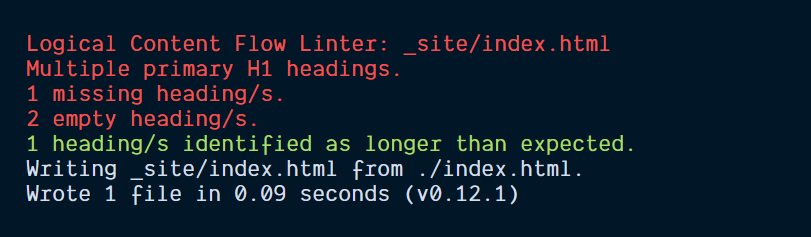

# eleventy-plugin-logical-content-flow

An [Eleventy](https://github.com/11ty/eleventy) linter plugin to check for issues with the [Logical Content Flow](https://defaced.dev/tools/logical-content-flow/) of the heading elements on your site.

**Like this project? Help support my projects and buy me a coffee via [ko-fi](https://ko-fi.com/defaced).**



## Installation

Available on [npm](https://www.npmjs.com/package/workeffortwaste/eleventy-plugin-logical-content-flow).

```
npm install eleventy-plugin-logical-content-flow --save-dev
```

Open up your Eleventy config file `.eleventy.js` and use `addPlugin`:

```js
const logicalContentFlow = require("eleventy-plugin-logical-content-flow");

module.exports = function(eleventyConfig) {
  eleventyConfig.addPlugin(logicalContentFlow);
};
```

## Known Issues

This plugin JSDOM to parse the output HTML. As the library doesn't render the page the checks for hidden headings and font size from the [Logical Content Flow Tool](https://defaced.dev/tools/logical-content-flow/) have not been included with this plugin.